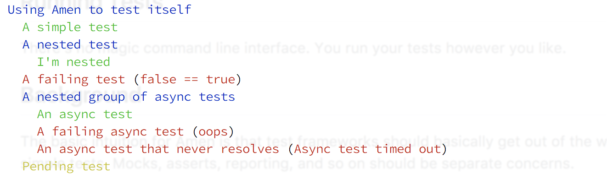

# Amen

Amen is a simple, flexible testing library that supports async functions, generators, and real-time live reporting via async iterators.

[](https://firstdonoharm.dev/version/3/0/core.html)

## Example

```coffeescript
import assert from "assert"
import { test, print } from "@dashkite/amen"

# Asynchronous functions to test
good = ->
  new Promise ( resolve ) ->
    setTimeout resolve, 100

bad = ->
  new Promise ( _, reject ) ->
    setTimeout ( -> reject new Error "oops" ), 100

never = -> new Promise ->

do ->
  await print test "Using Amen to test itself", [
    test "A simple test", -> assert true
    test "A nested test", [
      test "I'm nested", -> assert true
    ]
    test "A failing test", -> assert false
    test "A nested group of async tests", [
      test "An async test", -> await good()
      test "A failing async test", -> await bad()
      test "An async test that never resolves", -> await never()
    ]
    test "A pending test"
  ]
```

This generates output like this:



## Installation

Install Amen into your project using your favorite package manager:

```bash
# Example using pnpm
pnpm add -D @dashkite/amen
```

## Running Tests

There is no command line interface. Run your tests directly using Node or your custom task runner.

If any assertions or tests fail, Amen automatically sets `process.exitCode = 1` during the execution phase, ensuring that your test runner or CI/CD pipeline correctly registers the failure on exit.

## Background

The basic intuition for Amen is that test frameworks should get out of the way and let you write clear, simple tests. Mocking, assertions, and reporting should be separate concerns.

Async functions make it simple to handle asynchronous testing. Any test definition can return a Promise, a Generator, or an Async Generator, which Amen will execute and consume.

Amen is extremely small and extensible. Every test node implements `[Symbol.asyncIterator]` to stream execution events in real-time. For backward compatibility, the test node is also a Thenable that resolves to a nested result tree array.

## Other Resources

- [Reference Guide](file:///Users/dan/repos/dashkite/central-park/amen/docs/reference.md)
- [Usage Recipes](file:///Users/dan/repos/dashkite/central-park/amen/docs/recipes.md)

## Status

This project is currently not suitable for production use.
If you find a bug or have questions, please file an issue on the issue tracker.
